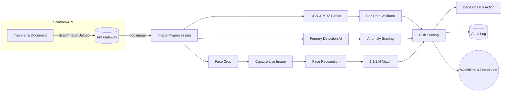

# AI-Based Border Document Screening (Executive Summary)
Border checkpoints see **massive passenger volumes** daily, making manual passport/ID checks slow and error-prone.  An AI-powered screening system can automate document and face authentication to accelerate processing and catch fraud.  It should parse standardized machine-readable zones (per ICAO 9303), validate formats, and use computer-vision to detect tampering (e.g. replaced photos, altered text or stamps) and compute a risk score.  Biometric face matching (both 1:1 live-to-doc and 1:N watchlists) with liveness checks boosts security.  Recent projects (EU D4FLY) demonstrate AI that reads and verifies passport stamps and logs them on a blockchain, and Smart Engines technology uses multispectral scanning (optical/UV/IR) to check document security features and detect overprints or overlays.  By integrating OCR, forgery detection, watchlist APIs (e.g. INTERPOL SLTD) and explainable risk scoring, the platform can reduce decision time from minutes to seconds, standardize checks, and generate an auditable trail. 

## Product Requirements (PRD) 
**Objectives & Scope:**  The system must ingest images of passports, visas, national IDs, driver’s licenses, and permits.  It should accurately extract fields (name, document number, nationality, DOB/expiry, gender, visa type/dates, etc.) and verify against standards (ICAO 9303 MRZ format, ISO country codes, official ID templates).  Core goals include **tampering detection**, **identity verification**, and **risk scoring** to flag suspect cases (e.g. expired/blacklisted docs, identity mismatches).  

**Functional Modules:**  
- **OCR & Data Extraction:** Segment and read MRZ/visual zones using OCR (Tesseract/EasyOCR or ML-based).  Validate **check-digits** (ICAO algorithm) for passport number, DOB, expiry, etc.  Use image processing to deskew and deblur.  
- **Document Validation:** Cross-check extracted data against known rules (e.g. country code formats, expected field lengths) and databases (issuing authority, MRZ checksum, chip read if available).  Check for **format anomalies** (alignment, font changes) that violate template standards.  
- **Tampering/Forgery Detection:** Apply ML models to detect signs of alteration.  Use **multimodal analysis**: 
  - *Photo Replacement*: Face in document vs printed pattern (e.g. human skin vs printed substrate).  
  - *Text Manipulation*: Compare font/color consistency, unusual background textures around text.  
  - *Stamp Forgery*: OCR stamps (entry/exit) and verify authenticity as in D4FLY.  Analyze stamp sequence to spot irregular travel routes or repeated/altered stamps.  
  - *Printing/Substrate Checks*: If hardware allows, use UV/IR imaging to verify UV-fluorescent fibers and inks.  Detect holograms or security threads via image analysis.  
  - *Image Metadata/History*: Flag documents with suspicious metadata (if scanned) or inconsistencies (e.g. source camera).  
- **Face Verification & Liveness:** Detect and crop face from the doc photo; perform **1:1 matching** against live-captured selfie with liveness (blink, challenge-response) to prevent spoofs.  Also support **1:N identification**: compare captured face against a gallery/watchlist (e.g. INTERPOL/PNR lists).  (Set matching thresholds to minimize false positives.)  Use state-of-art face encoders (FaceNet, ArcFace, InsightFace) tuned on border-quality images.  
- **Risk Scoring & Explainability:** Combine signals (forgery flags, mismatches, age of passport, watchlist hits, travel history anomalies) into a risk score.  Provide explainable indicators (e.g. “stamp sequence mismatch”, “MRZ checksum fail”, “face non-match”) so officers can understand decisions.  Maintain a **digital audit trail**: log images, extracted data, analysis results in a secure append-only log (ideally tamper-evident or blockchain-backed).  
- **APIs & Integration:** Expose RESTful APIs for image upload, verification results, and risk scores.  Integrate with external systems: passenger manifest/PNR data, INTERPOL SLTD (Stolen/Lost Travel Docs), local visa databases, watchlists of wanted/flagged individuals, and immigration control back-end systems.  Ensure data exchange adheres to standards (JSON/REST, HL7/FHIR not needed, but secure connections, e.g. mutual TLS).  
- **UI & Kiosk Interface:** Provide a user interface for border agents (web/desktop) showing the passport image, highlighted alerts, and recommended action.  Optionally a self-service kiosk/tablet mode that guides travelers (scans doc, takes photo) and alerts an officer only on exceptions.

**Performance Targets:**  Aim for **real-time** processing (under 2-5 seconds per passenger) and support high throughput (hundreds to thousands per hour per checkpoint).  Accuracy goals should target low error rates: e.g. *False Negative Rate (missed forgery)* under ~1-2%, *False Positive Rate* tuned very low (≤0.1%) to avoid wrongly flagging legitimate travelers.  Use continuous monitoring and alert if drift or accuracy drops. 

**Security & Privacy:**  Encrypt data at rest/in transit.  Handle PII (biographics, biometrics) per GDPR and local laws: store minimal data, allow audit access controls.  Keys and ML models should be securely managed.  Sensitive logs should be hashed and signed (blockchain or WORM storage) to prevent tampering.  

**Deployment & Scalability:**  The system should be containerized (Docker/K8s) for scalability.  Consider **edge deployment** for offline checkpoints (local inference) vs **cloud** for heavy computation and model updates.  Use load balancing and horizontal scaling for bursts (peak travel hours).  Plan CI/CD pipeline for continual model updates (with human-in-the-loop validation) and automated testing (unit, integration, performance).  

**Datasets & Training:**  Leverage public datasets where possible: MIDV-500/2019/2020 for clean doc images, IDNet (837K synthetic docs with diverse fraud), as well as face datasets (LFW, MS-Celeb, or border-specific sets).  Collect or simulate additional examples of *real* passport forgeries (morphs, reprints).  Use data augmentation and synthetic fraud generation (GANs or editors) to supplement.  Evaluate with metrics like precision/recall per forgery type and face matching ROC curves (FRVT benchmarks).  Test adversarial robustness (e.g. image perturbations, print-scan variations) and employ defenses (adversarial training, robust architectures).

## System Architecture (Mermaid Diagram)  
A high-level architecture (below) organizes components into services.  Key flows: image capture → OCR/ML services → databases/logs → UI/dashboard.  Below, “Doc Processor” splits into OCR and Tamper-detection branches; a “Face Service” handles live capture; a “Risk Engine” aggregates results. Integration with Watchlist DBs (e.g. SLTD) and *external systems* (Immigration) is shown.  

## Technology Stack Comparison  

| Stack Option              | Pros                                                | Cons                                               | Recommended Use |
|---------------------------|-----------------------------------------------------|----------------------------------------------------|-----------------|
| **Next.js + FastAPI**     | Scalable frontend (React+SSR) + fast Python backend; clean separation of UI and ML logic. FastAPI auto-generates docs, supports async. Good for ML inference services. | Two languages/frameworks to maintain. More DevOps complexity. Mid-level learning curve. | Ideal if strong Python/JS teams and need SEO or SSR. |
| **MERN (Mongo/Express/React/Node)** | All-JS stack; large ecosystem. Good for rapid UI/DB development. | ML/vision libs less native (must call Python). Potentially higher computation cost for heavy tasks. Single-threaded Node might need clustering. | Use if team expertise is JS-heavy, and ML is offloaded to microservice. |
| **FastAPI + React**       | Python backend for ML (uses TensorFlow/PyTorch) and React SPA UI. Easy ML integration. FastAPI is high-performance. | Less built-in SSR; separate deployment. Two stacks. | Good balance for internal app; use Python for vision, React for UI. |

All options can be containerized (Docker). Use **Python (FastAPI/Pytorch/TensorFlow/OpenCV)** for ML services, **React/Next.js** or Angular for UI, and a **database** (PostgreSQL or MongoDB) for records. Deploy on Kubernetes (cloud/edge) with GPU support for AI models.

## Prioritized Roadmap and Milestones  
- **M1 (Weeks 1-2):** Define data schema & system requirements, procure sample documents; set up dev environment.  
- **M2 (3-5):** Implement OCR module and MRZ parser; integrate MRZ checksum validation. Validate on known samples.  
- **M3 (5-8):** Develop Document Validation rules (format checks, issuing country codes). Begin integration with watchlist APIs (SLTD).  
- **M4 (6-10):** Build Face Service: face detection, 1:1 matching with liveness. Test against NIST-like datasets.  
- **M5 (8-12):** Train tampering models: stamp analysis, photo/text manipulation. Use synthetic data (IDNet, MIDV) for training.  
- **M6 (10-14):** Risk Engine & UI: combine signals, design risk score schema, create agent dashboard with explainable alerts.  
- **M7 (12-16):** Integration & Testing: connect modules, stress-test throughput, tune performance. Ensure <5s latency.  
- **M8 (16+):** Pilot deployment at select checkpoint. Monitor accuracy (FAR/FNR), gather feedback, and refine models.  

**QA Plan:** Include unit tests for OCR and validation logic, end-to-end tests with legitimate and forged doc images. Regularly use independent test sets (NIST FRVT for face, custom forgery sets) to benchmark performance. Log false positives/negatives for continuous improvement.

## Clarifying Questions (for Antigravity) 
- Expected **throughput**: How many documents per minute/hour? (determines scaling).  
- **Latency budget** per passenger (e.g. <2s or <5s)?  
- Deployment environment: fully **on-prem/air-gapped** (border) or cloud? Allowed internet?  
- Hardware constraints: cameras only, or specialized UV/IR scanners available? GPUs on-site?  
- Existing systems: Any current ID scanners, databases, or kiosks to integrate?  
- Regulatory domain: Are travelers EU (GDPR) or others (India-specific privacy law)?  
- **Budget/timeline** constraints: affects use of open-source vs commercial APIs or hardware.  

---

**Prompt for Antigravity:**  
*Using the above requirements and research, generate:* a detailed Product Requirements Document (PRD) and system architecture for an AI-based fake identity and document screening system at border checkpoints. The PRD should cover objectives, scope (passports, visas, IDs, licenses, permits), and functional modules (OCR/MRZ parsing, document validation, tampering detection including photo/text/stamp anomalies, face verification with liveness and watchlists, risk scoring, audit logging, etc.). Propose performance targets (latency, accuracy rates) and security/privacy controls (GDPR, encryption). 

Include **system architecture diagrams** (Mermaid) showing components, data flow, and deployment topology. Compare technology stacks (Next.js+FastAPI vs MERN vs FastAPI+React) in a table with pros/cons, recommending the best option. Include tables of example datasets, model choices, and trade-offs. Finally, provide a prioritized implementation roadmap and QA strategy. 

*Ask any clarifying questions* (e.g. target throughput, hardware, regulatory region) if needed to refine the solution.  

**Sources:** ICAO 9303 standards; EU D4FLY border security projects; Smart Engines passport verification; INTERPOL SLTD watchlist; IDNet document dataset; NIST FRVT face recognition benchmarks.