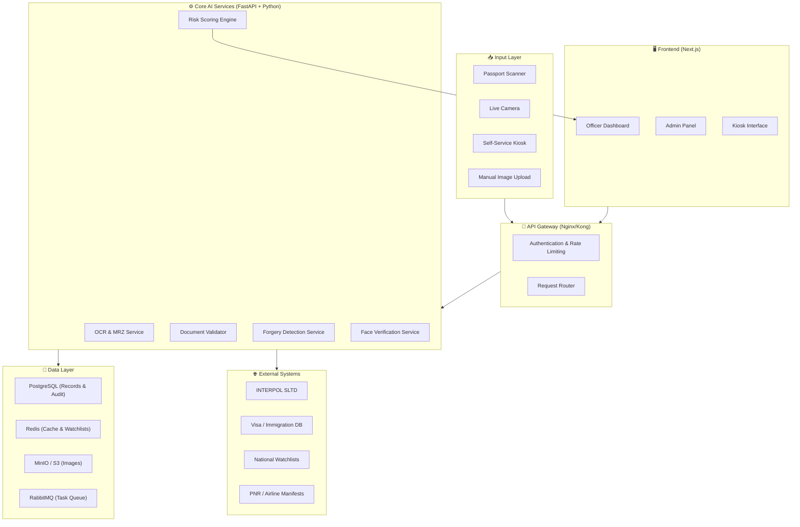
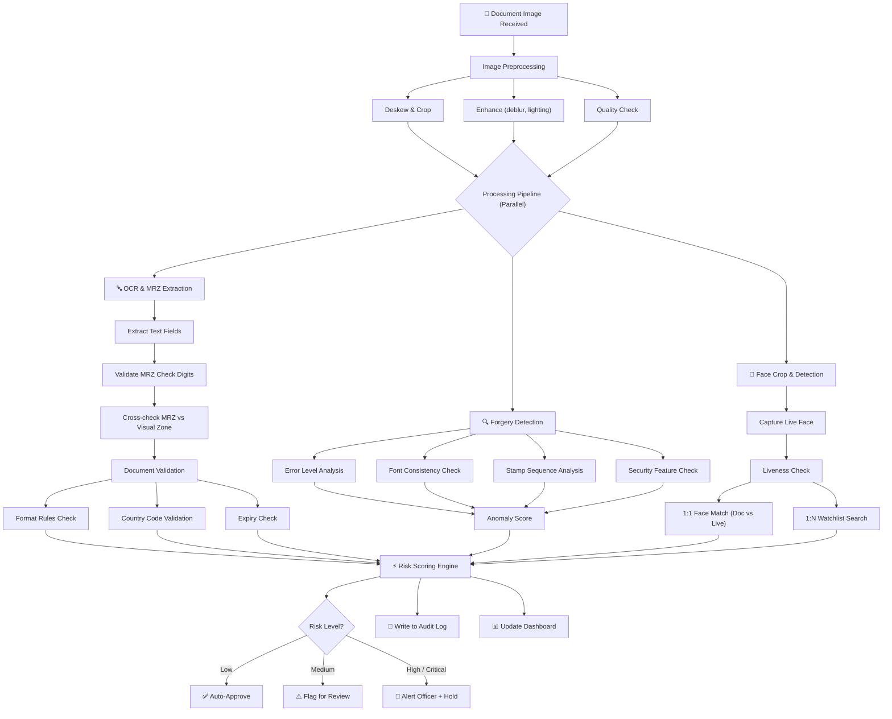
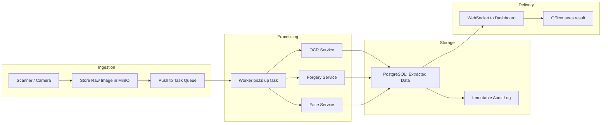
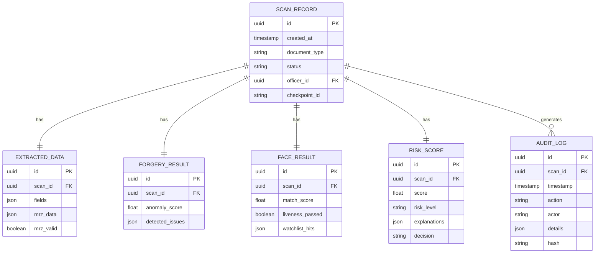

# System Architecture
## AI-Based Border Document Screening System

---

## 1. Architecture Overview (Plain English)

The system is built as **microservices** — meaning each major function (OCR, face matching, forgery detection, etc.) runs as its own independent service. They all talk to each other through a central **API Gateway**. This design lets us:

- Scale each piece independently (need more OCR power? Just add more OCR pods)
- Update one service without breaking others
- Deploy heavy AI services on GPU machines while keeping the UI on lighter servers

---

## 2. Finalized Tech Stack

> [!IMPORTANT]
> **Chosen Stack: Next.js (Frontend) + FastAPI (Backend AI Services) + PostgreSQL + Redis**

### Why This Stack?

| Layer | Technology | Why We Chose It |
|-------|-----------|-----------------|
| **Frontend / UI** | **Next.js (React)** | Server-side rendering for fast page loads, built-in API routes, huge React ecosystem, excellent for dashboards |
| **Backend AI Services** | **FastAPI (Python)** | Python is where all the AI/ML libraries live (PyTorch, TensorFlow, OpenCV, dlib). FastAPI is async and very fast. Auto-generates API docs. |
| **Primary Database** | **PostgreSQL** | Rock-solid relational DB. Supports JSON fields for flexible data. Great for structured records (audit logs, user accounts, document records) |
| **Cache / Hot Data** | **Redis** | In-memory store for watchlist caching, session management, and real-time risk score lookups |
| **Object Storage** | **MinIO** (self-hosted) or **S3** | Stores document images and face captures. Keeps the database lean. |
| **Message Queue** | **RabbitMQ** or **Redis Streams** | Handles async tasks (e.g., queue a forgery analysis while returning OCR results first) |
| **ML Frameworks** | **PyTorch + OpenCV + ONNX Runtime** | PyTorch for model training, ONNX for optimized inference, OpenCV for image processing |
| **Face Recognition** | **InsightFace (ArcFace)** | State-of-the-art face matching, open source, works well on border-quality images |
| **OCR Engine** | **EasyOCR + custom MRZ parser** | EasyOCR handles multi-language text; custom parser for ICAO 9303 MRZ decoding and check digit validation |
| **Containerization** | **Docker + Kubernetes** | Each service runs in a container. K8s manages scaling, health checks, restarts |
| **API Gateway** | **Nginx / Kong** | Routes requests, handles rate limiting, SSL termination, authentication |
| **Monitoring** | **Prometheus + Grafana** | System health monitoring, latency tracking, alert dashboards |
| **Logging** | **ELK Stack (Elasticsearch, Logstash, Kibana)** | Centralized logging for all services, searchable audit trail |

---

### Stack Comparison (Why Not the Others?)

| Stack | Pros | Cons | Verdict |
|-------|------|------|---------|
| **Next.js + FastAPI** ✅ | Best of both worlds — React for UI, Python for AI. Clean separation. FastAPI is async and blazing fast. | Two languages (JS + Python) to maintain | **CHOSEN** — best fit for an AI-heavy system with a good UI |
| **MERN (MongoDB + Express + React + Node)** | All JavaScript — one language everywhere. Fast to prototype. | ML/AI libraries in Node.js are weak. You'd still need to call Python for the hard parts. Adds complexity without benefit. | ❌ Rejected — doesn't play to AI strengths |
| **FastAPI + React (no Next.js)** | Simpler than Next.js. Python backend is great. | No server-side rendering — slower first page load. Less built-in features than Next.js. | ❌ Close second — but Next.js adds real value for the dashboard |

---

## 3. High-Level System Architecture

---

## 4. Detailed Processing Flow

---

## 5. Microservices Breakdown

### 5.1 — Image Preprocessing Service

| Property | Detail |
|----------|--------|
| **Language** | Python |
| **Libraries** | OpenCV, Pillow |
| **Input** | Raw document image (JPEG/PNG/TIFF) |
| **Output** | Cleaned, deskewed, cropped image |
| **What it does** | Straightens tilted scans, removes glare, adjusts brightness/contrast, crops to document edges, checks image quality (reject if too blurry) |

### 5.2 — OCR & MRZ Service

| Property | Detail |
|----------|--------|
| **Language** | Python |
| **Libraries** | EasyOCR, custom ICAO 9303 MRZ parser |
| **Input** | Preprocessed document image |
| **Output** | Structured JSON with all extracted fields + MRZ validation results |
| **What it does** | Detects and reads MRZ lines, extracts visual zone text, validates check digits, compares MRZ vs visual zone for consistency |

### 5.3 — Document Validation Service

| Property | Detail |
|----------|--------|
| **Language** | Python |
| **Libraries** | Custom rule engine |
| **Input** | Extracted fields JSON |
| **Output** | Validation report (pass/fail per field, list of anomalies) |
| **What it does** | Checks field formats against known templates, validates country codes (ISO 3166), checks date logic (not expired, birth date reasonable), cross-references with issuing authority data |

### 5.4 — Forgery Detection Service

| Property | Detail |
|----------|--------|
| **Language** | Python |
| **Libraries** | PyTorch, OpenCV, custom CNN/Transformer models |
| **Input** | Preprocessed document image + segmented zones |
| **Output** | Anomaly score (0-100) + list of detected issues |
| **What it does** | Runs Error Level Analysis, font consistency checks, stamp authenticity checks, photo replacement detection, security feature verification. Uses a YOLO model to segment document into zones first. |

### 5.5 — Face Verification Service

| Property | Detail |
|----------|--------|
| **Language** | Python |
| **Libraries** | InsightFace (ArcFace), OpenCV, dlib |
| **Input** | Document face crop + live camera capture |
| **Output** | Match confidence score + liveness result + watchlist hit results |
| **What it does** | Detects face in document, captures live face, runs liveness check (blink/motion), computes 1:1 similarity score, searches against watchlist database (1:N) |

### 5.6 — Risk Scoring Engine

| Property | Detail |
|----------|--------|
| **Language** | Python |
| **Libraries** | Custom scoring logic + optional ML model |
| **Input** | Results from all other services |
| **Output** | Final risk score + risk level (Low/Medium/High/Critical) + human-readable explanation |
| **What it does** | Weights and combines all signals, checks against external databases (INTERPOL SLTD, watchlists), applies configurable thresholds, generates plain-language explanation for each flag |

---

## 6. Data Flow Architecture

---

## 7. API Design Overview

All backend services expose **REST APIs**. Key endpoints:

| Endpoint | Method | Purpose |
|----------|--------|---------|
| `/api/v1/scan` | POST | Upload a document image for full processing |
| `/api/v1/scan/{id}/status` | GET | Check processing status |
| `/api/v1/scan/{id}/result` | GET | Get full verification result |
| `/api/v1/face/verify` | POST | Submit live face image for 1:1 matching |
| `/api/v1/face/watchlist` | POST | Run 1:N watchlist search |
| `/api/v1/risk/{scan_id}` | GET | Get risk score and explanation |
| `/api/v1/audit/logs` | GET | Search audit trail (with filters) |
| `/api/v1/watchlist/sync` | POST | Sync external watchlist data |
| `/api/v1/health` | GET | System health check |

**Authentication:** JWT tokens with role-based access control  
**Rate Limiting:** Per-user and per-endpoint limits via API Gateway  
**Data Format:** JSON request/response bodies

---

## 8. Database Schema (High Level)

---

## 9. Communication Between Services

| From → To | Method | Why |
|-----------|--------|-----|
| Frontend → API Gateway | HTTPS (REST) | Standard web requests |
| API Gateway → Backend Services | HTTP (internal) | Fast internal routing |
| Between AI Services | **Message Queue** (RabbitMQ) | Decouples services, handles bursts, enables parallel processing |
| Risk Engine → Dashboard | **WebSocket** | Real-time push of results to officer screen |
| Backend → External DBs | HTTPS (REST + mTLS) | Secure connection to INTERPOL, watchlists, etc. |

---

## 10. Key Architecture Decisions

| Decision | Rationale |
|----------|-----------|
| **Microservices, not monolith** | Each AI module has different compute needs (GPU for face/forgery, CPU for OCR). Separate scaling. |
| **Python for all AI services** | All serious ML libraries (PyTorch, OpenCV, InsightFace) are Python-native. No point fighting this. |
| **Next.js for frontend** | SSR for fast dashboard loads, built-in API routes, React ecosystem for rich UI components |
| **PostgreSQL over MongoDB** | Structured audit data needs ACID compliance. Relational queries for investigations. JSON columns for flexible fields. |
| **Message queue for processing** | Document analysis takes 2-5 seconds. Queue lets us handle bursts without dropping requests. |
| **Redis for watchlists** | Watchlist lookups must be sub-millisecond. Redis keeps hot data in memory. |
| **ONNX Runtime for inference** | Converts trained PyTorch models to optimized format. 2-5x faster inference without rewriting models. |
